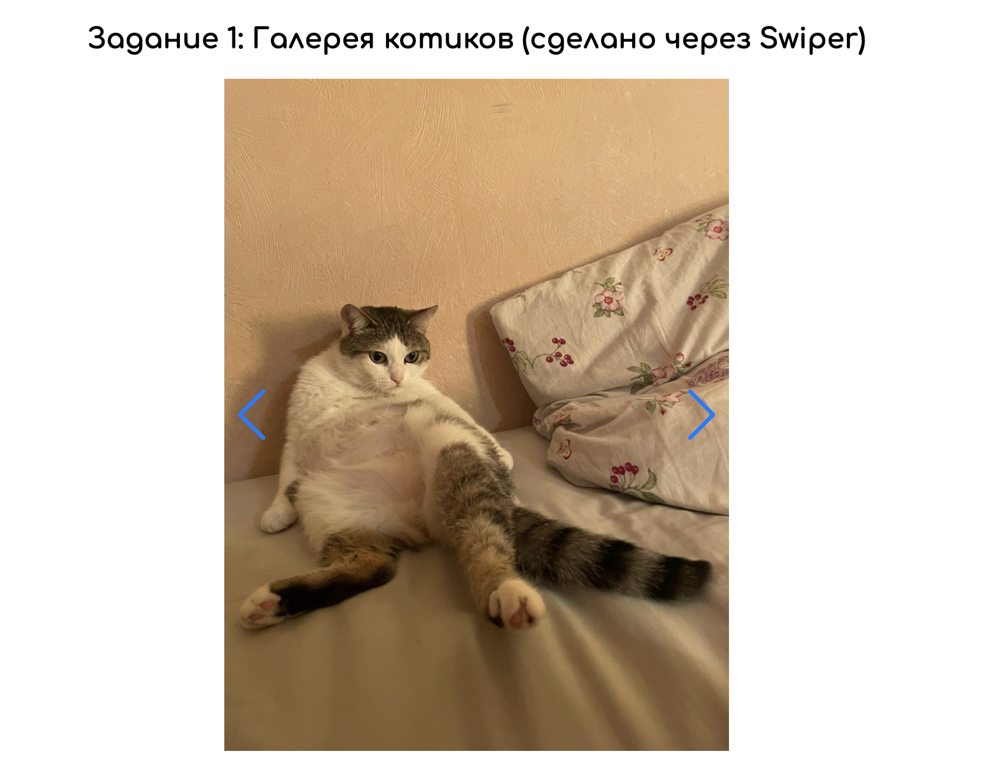
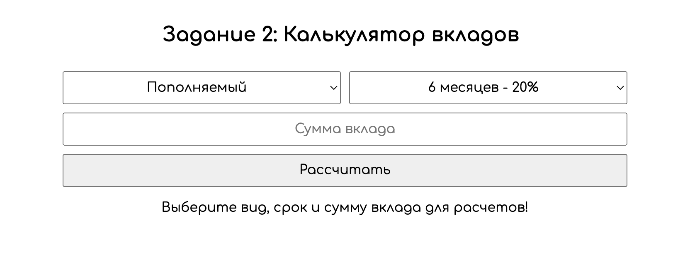
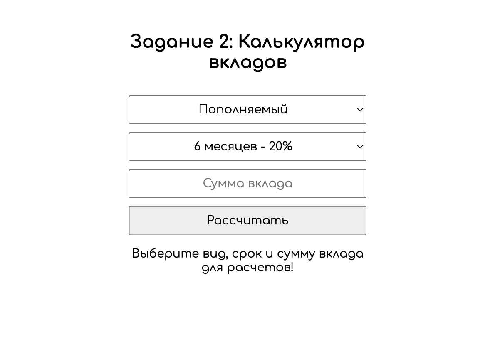

#Лабораторная работа №2
##Основы git и JS

###Чтобы запустить проект нужно:
1) Иметь подключение к интернету
2) Сделать git clone репозитория
3) Перейти на ветку develop (git checkout develop)
4) Открыть файл index.html

###Проект с адаптивной разметкой!
####

####Внимание! 
Внешний вид будет некорректно отображаться в браузере Safari, о чем предупредит алерт при запуске в этом браузере

